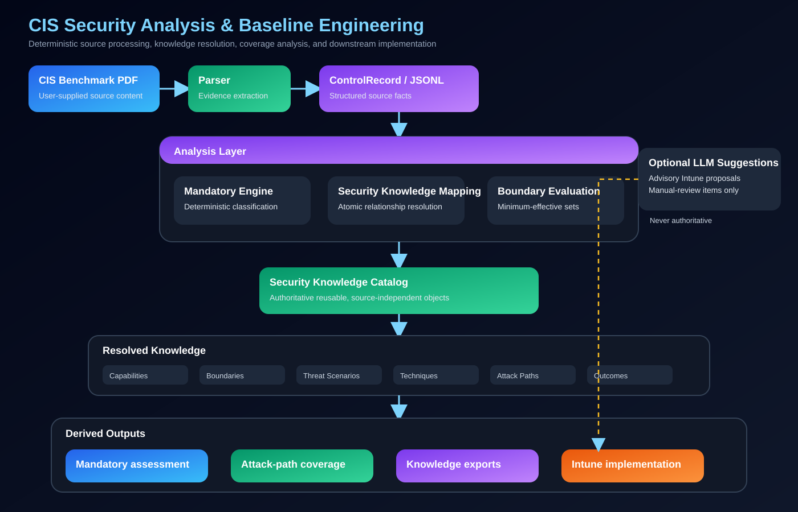
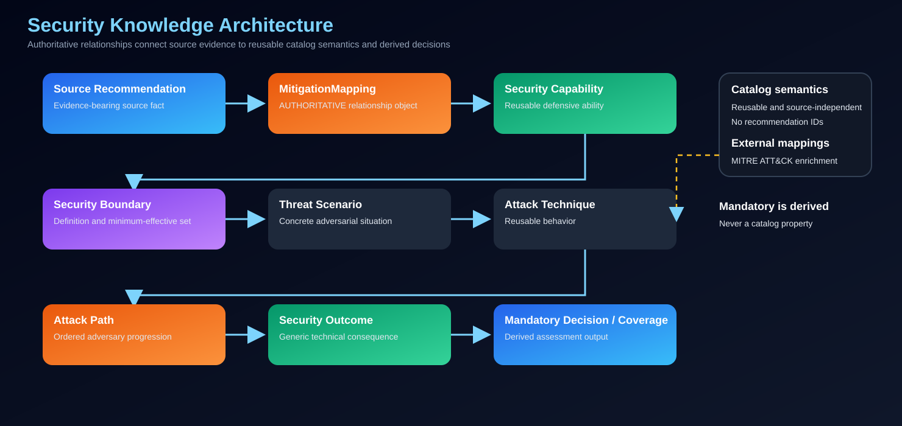
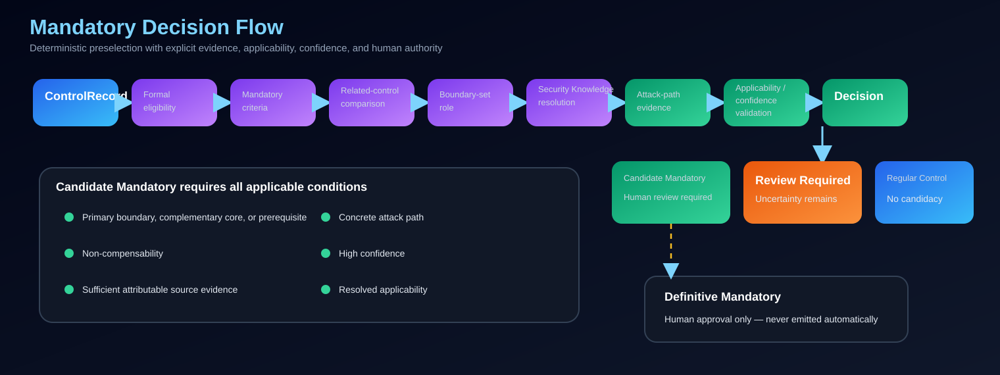
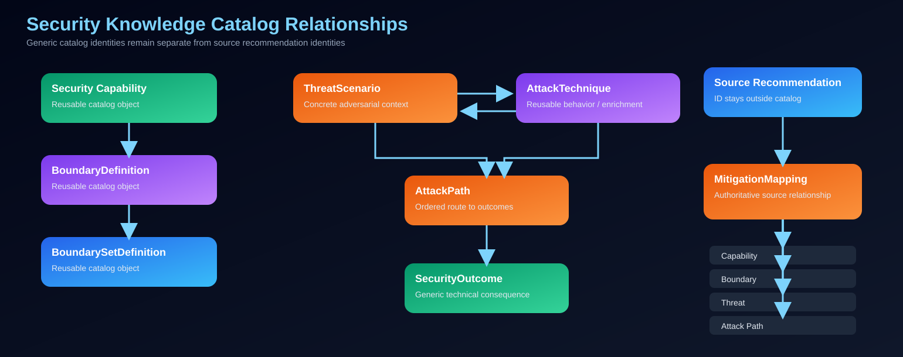

# CIS Security Analysis and Baseline Engineering Toolkit


This repository implements a CIS security-analysis and baseline-engineering toolkit with three primary layers:

1. **CIS benchmark parsing** into evidence-bearing structured records;
2. **Mandatory-control reasoning** over minimum-effective security boundaries; and
3. **Security Knowledge enrichment** through reusable capabilities, boundaries, threats, techniques, attack paths, and outcomes.

Microsoft Intune mapping and baseline generation are downstream implementation capabilities; they are not the project's central knowledge model.

The toolkit can:

- parse CIS Benchmark PDFs into structured `ControlRecord` data and export JSONL or CSV;
- compare structured exports from different benchmark versions;
- normalize recommendation values and deterministically map selected controls to Intune;
- classify controls as **Regular Control**, **Review Required**, or **Candidate Mandatory**;
- evaluate minimum-effective security boundary sets;
- enrich controls with Security Capabilities, Security Boundaries, Threat Scenarios, Attack Techniques, Attack Paths, and Security Outcomes;
- resolve reusable knowledge through the authoritative Security Knowledge Catalog;
- produce attack-path and boundary coverage analysis; and
- optionally request LLM suggestions only for Intune mappings already routed to manual review. Suggestions remain advisory and never replace deterministic decisions.

> **CIS benchmark content is not included.** Users must obtain benchmark documents separately and comply with the CIS Terms of Use.

## Architecture

### System architecture



The parser establishes traceable source records. Mandatory reasoning, Security Knowledge mapping, and boundary evaluation form the analysis layer; catalog resolution then supports assessments, coverage, exports, and optional downstream Intune generation. The LLM suggestion engine is an advisory side path outside the authoritative deterministic chain.

### Security Knowledge architecture



The semantic chain separates source evidence, authoritative atomic `MitigationMapping` relationships, reusable catalog objects, and derived Mandatory or coverage results. External-framework mappings such as MITRE ATT&CK are controlled enrichments.

### Mandatory decision flow



Candidate selection requires formal evidence, boundary role, attack-path support, non-compensability, applicability, and confidence. The engine never grants Definitive Mandatory status; only a human approval can do so.

### Catalog relationships



Generic catalog objects remain source-independent. Source recommendation identifiers exist only on mapping/evaluation objects, with `MitigationMapping` providing the authoritative source-to-knowledge relationship.

Detailed design documentation:

- [Mandatory Control Engine — Phase 1](docs/mandatory-control-phase1.md)
- [Security Knowledge Model](docs/SECURITY_KNOWLEDGE_MODEL.md)
- [Security Knowledge Catalog](docs/SECURITY_KNOWLEDGE_CATALOG.md)
- [Security Knowledge Model implementation](docs/SECURITY_KNOWLEDGE_MODEL_IMPLEMENTATION.md)
- [v1 release candidate notes](docs/V1_RELEASE_NOTES.md)
- [Security Knowledge — Phase 1](docs/security-knowledge-phase1.md)
- [Intune mapping flow](docs/mapping_flow.svg), [policy generation](docs/policy_generation.svg), and [coverage lifecycle](docs/coverage_lifecycle.svg)

## Capabilities

### CIS Benchmark Parser

The parser converts a supported CIS Benchmark PDF layout into `ControlRecord` objects. It exports one record per JSONL line or quoted UTF-8-BOM CSV for reporting and Excel interoperability.

Extracted data includes benchmark name/version/date; control ID, profile, title, assessment type, and applicability; description, rationale, impact, audit, remediation, default value, and references. Page ranges, the source PDF SHA-256, the extracted block SHA-256, parser version, and extraction timestamp preserve source traceability.

The current parser recognizes Microsoft Windows Server and Microsoft 365
Foundations benchmark identity headers plus the recommendation-section
vocabulary implemented in `parser.py`. Unsupported or ambiguous identity is a
controlled error; it never defaults to Windows Server. A recognized identity
does not by itself guarantee compatibility with every historical PDF layout.

### Mandatory Control Engine

The Mandatory engine is deterministic and operates on parser-produced `ControlRecord` JSONL. It does **not** encode a target number or percentage of Mandatory controls. It emits:

- **Candidate Mandatory** for a formally eligible, sufficiently evidenced, non-compensable primary boundary, complementary core member, or prerequisite with the required attack-path evidence;
- **Review Required** when applicability, evidence, comparison, overlap, completeness, or knowledge resolution remains uncertain; and
- **Regular Control** for controls that do not meet Candidate requirements and do not require adjudication.

The integrated completion rule requires at least **85% of all in-scope recommendations** to pass **and** every applicable control approved by a human as Definitive Mandatory to pass. Mandatory controls remain in the ordinary CIS denominator; they cannot occupy the maximum 15% non-compliant portion.

Boundary-set completeness is based on required security effects, prerequisites, selected alternatives, and applicability—not the number of mapped controls. Candidate conclusions also require a concrete attack path and evidence that remaining controls cannot compensate for the omitted effect.

The validated Windows Server L1 regression example contains **307 controls: 27 Candidate Mandatory, 5 Review Required, and 275 Regular Control**. This is a regression result, not a quota or desired ratio.

See [Mandatory Control Engine — Phase 1](docs/mandatory-control-phase1.md).

### Security Knowledge Engine

The [normative Security Knowledge Model](docs/SECURITY_KNOWLEDGE_MODEL.md) separates facts, mappings, inferences, and decisions. It implements typed, source-independent knowledge for:

- Security Capabilities;
- `BoundaryDefinition`, `BoundarySetDefinition`, and contextual `BoundaryEvaluation` objects;
- Threat Scenarios and reusable Attack Techniques;
- ordered Attack Paths and Security Outcomes;
- atomic `MitigationMapping` relationships with independent boundary role, mitigation role, and mitigation strength; and
- qualitative coverage semantics that distinguish complete standalone protection, complete complementary sets, supporting-only coverage, detection-only coverage, incomplete boundaries, and no effective mitigation.

Mandatory is derived from resolved knowledge and assessment context. It is not a catalog property. Risk percentages are not inferred from control counts.

### Security Knowledge Catalog

The authoritative catalog is reusable and source-independent. Its current deterministic inventory is:

| Object | Count |
|---|---:|
| Security Capabilities | 10 |
| Boundary definitions | 27 |
| Boundary-set definitions | 23 |
| Threat Scenarios | 32 |
| Attack Techniques | 21 |
| Attack Paths | 26 |
| Security Outcomes | 14 |

Catalog validation must produce **zero errors** before the catalog is treated as authoritative. Stable IDs, lifecycle state, provenance, active references, external mappings, and legacy migration coverage are validated. The committed `security-knowledge-catalog.json` is a byte-stable deterministic export; there is currently no dedicated catalog CLI entry point.

The release-candidate catalog version is **1.2.0**. Runtime builds it from the
Python catalog definitions; the root JSON file is the deterministic publication
artifact and is not required at runtime after wheel installation.

### Normative shadow evaluation

Advisory shadow mode is implemented behind `cis-mandatory-analyze
--shadow-normative`. It evaluates catalog mappings and benchmark-scoped
boundaries in parallel with the unchanged production Mandatory classifier.
Shadow results never override production classifications and do not authorize a
classifier cutover. Microsoft 365 identity/authentication and application,
consent, service-principal, and workload-identity slices remain advisory and
route incomplete knowledge to Review Required.

See the [catalog specification](docs/SECURITY_KNOWLEDGE_CATALOG.md) and [relationship diagram](docs/security_knowledge_catalog.svg).

### Intune Mapping

The Intune mapper is a downstream implementation engine for applicable parsed controls. It normalizes input, parses boolean/range/numeric/string recommendation values, evaluates modular Windows Server rule packs, resolves deterministic conflicts, and writes:

- `baseline.csv`;
- `manual_review.csv`;
- `conflicts.csv`;
- `intune_policies.json`; and
- `suggested_mappings.jsonl`.

Current rule packs cover account policies, audit policy, security options, Defender, firewall, credential protection, event log, and remote access for the `windows_server_2025` target. These mappings are not a claim that every benchmark recommendation has an Intune implementation.

Microsoft 365 and unknown, ambiguous, or unsupported benchmark families do not
run Windows rules. They produce explicit `UNSUPPORTED_BENCHMARK_FAMILY`
manual-review output. Microsoft 365 Intune mapping is not supported in v1.

When `--llm-fallback` is requested, only `manual_review` mappings are submitted for suggestions. Output is a proposal requiring validation and has no authority over parser facts, Mandatory classification, Security Knowledge resolution, or deterministic Intune rules.

### Benchmark Diff

The diff module compares two parser-produced JSONL exports using benchmark/profile/control identity and emits added, removed, and field-level changed records. Output can be CSV or JSONL, with optional summary and full Markdown reports.

## Current Workflow

1. Obtain and parse a CIS Benchmark PDF.
2. Produce structured `ControlRecord` JSONL.
3. Run deterministic Mandatory analysis.
4. Resolve and validate Security Knowledge relationships.
5. Review Candidate Mandatory and Review Required results.
6. Examine attack-path and boundary coverage.
7. Optionally map applicable controls to Intune and validate manual-review suggestions.
8. Compare benchmark versions when required.

## Installation

```bash
git clone https://github.com/koensmink/cis-intune-baseline-generator.git
cd cis-intune-baseline-generator
python -m pip install -e .
```

Python 3.10 or later is required.

## CLI Usage

The package installs three console commands:

- `cis-pdf2csv` — parse one or more CIS Benchmark PDFs to structured CSV/JSONL, or pass one JSONL file to the Intune mapper;
- `cis-mandatory-analyze` — run deterministic Mandatory-control preselection and attack-path coverage;
- `cis-intune-map` — map parser-produced JSONL to Intune baseline artifacts.

The benchmark diff is implemented as the Python module `cis_pdf2csv.diff`; no standalone diff console script is currently registered. There is also no standalone Security Knowledge or catalog CLI at this time.

The registered console entry points are defined in [`pyproject.toml`](pyproject.toml). CLI implementation details are in [`src/cis_pdf2csv/cli.py`](src/cis_pdf2csv/cli.py), [`src/cis_pdf2csv/mandatory/cli.py`](src/cis_pdf2csv/mandatory/cli.py), [`src/cis_pdf2csv/intune_mapper/cli.py`](src/cis_pdf2csv/intune_mapper/cli.py), and [`src/cis_pdf2csv/diff.py`](src/cis_pdf2csv/diff.py).

### CIS Benchmark parser

#### Parse to JSONL

Installed command:

```bash
cis-pdf2csv benchmark.pdf -p L1 -o controls.jsonl --format jsonl
```

Equivalent module invocation:

```bash
python -m cis_pdf2csv benchmark.pdf -p L1 -o controls.jsonl --format jsonl
```

The package-level module invocation is supported by [`src/cis_pdf2csv/__main__.py`](src/cis_pdf2csv/__main__.py).

#### Parse to CSV

```bash
cis-pdf2csv benchmark.pdf -p L1 -o controls.csv --format csv
```

Equivalent module invocation:

```bash
python -m cis_pdf2csv benchmark.pdf -p L1 -o controls.csv --format csv
```

CSV output uses quoted UTF-8 with BOM for Excel compatibility.

#### Parse without a profile filter

```bash
cis-pdf2csv benchmark.pdf -o controls.jsonl --format jsonl
```

When `-p/--profile` is omitted, all parser-recognized profiles are included.

#### Parse multiple benchmark PDFs

```bash
cis-pdf2csv benchmark_v1.pdf benchmark_v2.pdf -p L1 -o combined.jsonl --format jsonl
```

All positional inputs must be PDFs in parser mode. Records are emitted in deterministic order by benchmark name, benchmark version, and control ID.

### Mandatory analysis and coverage

Installed command:

```bash
cis-mandatory-analyze controls.jsonl -o mandatory-review.csv
```

Equivalent module invocation:

```bash
python -m cis_pdf2csv.mandatory.cli controls.jsonl -o mandatory-review.csv
```

For an output path such as `mandatory-review.csv`, the command writes:

```text
mandatory-review.csv
mandatory-review-candidate-mandatory.csv
mandatory-review-review-required.csv
mandatory-review-summary.json
mandatory-review-attack-path-coverage.json
```

The Mandatory engine consumes parser-produced `ControlRecord` JSONL. It does not modify the source JSONL.

See:

- [Mandatory Control Engine — Phase 1](docs/mandatory-control-phase1.md)
- [Security Knowledge — Phase 1](docs/security-knowledge-phase1.md)
- [Security Knowledge Model](docs/SECURITY_KNOWLEDGE_MODEL.md)
- [Security Knowledge Catalog](docs/SECURITY_KNOWLEDGE_CATALOG.md)

### Security Knowledge and catalog

There is currently no dedicated Security Knowledge or catalog CLI. The authoritative catalog is represented in code and by the committed deterministic [`security-knowledge-catalog.json`](security-knowledge-catalog.json). Mandatory analysis produces Security Knowledge enrichment and attack-path coverage through the integrated analysis pipeline.

See:

- [Security Knowledge Model](docs/SECURITY_KNOWLEDGE_MODEL.md)
- [Security Knowledge Catalog](docs/SECURITY_KNOWLEDGE_CATALOG.md)
- [Security Knowledge Model implementation](docs/SECURITY_KNOWLEDGE_MODEL_IMPLEMENTATION.md)
- [Security Knowledge architecture](docs/security_knowledge_architecture.svg)
- [Catalog relationships](docs/security_knowledge_catalog.svg)

### Benchmark diff

The diff command compares two parser-produced JSONL exports.

#### Basic CSV diff

```bash
python -m cis_pdf2csv.diff old.jsonl new.jsonl -o changes.csv
```

#### JSONL diff

```bash
python -m cis_pdf2csv.diff old.jsonl new.jsonl -o changes.jsonl --format jsonl
```

If `--format` is omitted, the output extension determines whether CSV or JSONL is written.

#### Diff with summary and full reports

```bash
python -m cis_pdf2csv.diff old.jsonl new.jsonl \
  -o changes.csv \
  --report report.md \
  --full-report report_full.md
```

The comparison reports added, removed, and field-level changed controls. The summary report provides aggregate and per-control change information; the full report additionally contains old/new field values for changed controls.

#### Example: compare two benchmark versions

```bash
cis-pdf2csv benchmark_v1.pdf -p L1 -o v1.jsonl --format jsonl
cis-pdf2csv benchmark_v2.pdf -p L1 -o v2.jsonl --format jsonl

python -m cis_pdf2csv.diff v1.jsonl v2.jsonl \
  -o changes.csv \
  --report report.md \
  --full-report report_full.md
```

### Intune mapping

Installed command:

```bash
cis-intune-map controls.jsonl -o intune_out
```

Equivalent module invocation:

```bash
python -m cis_pdf2csv.intune_mapper.cli controls.jsonl -o intune_out
```

The top-level parser CLI also detects a single JSONL input and dispatches it to the Intune mapper:

```bash
cis-pdf2csv controls.jsonl -o intune_out
```

The mapper writes:

```text
intune_out/
├── baseline.csv
├── manual_review.csv
├── conflicts.csv
├── intune_policies.json
└── suggested_mappings.jsonl
```

### Intune LLM fallback

LLM assistance is optional and applies only to controls that remain unresolved after deterministic mapping.

With an OpenAI API key:

```bash
OPENAI_API_KEY=your_api_key \
cis-intune-map controls.jsonl -o intune_out --llm-fallback
```

Equivalent module invocation:

```bash
OPENAI_API_KEY=your_api_key \
python -m cis_pdf2csv.intune_mapper.cli controls.jsonl -o intune_out --llm-fallback
```

The top-level parser CLI can also dispatch JSONL to the mapper:

```bash
OPENAI_API_KEY=your_api_key \
cis-pdf2csv controls.jsonl -o intune_out --llm-fallback
```

The optional model can be overridden:

```bash
OPENAI_API_KEY=your_api_key \
OPENAI_MODEL=gpt-4.1-mini \
cis-intune-map controls.jsonl -o intune_out --llm-fallback
```

If `--llm-fallback` is specified without `OPENAI_API_KEY`, the current implementation falls back to heuristic suggestions instead of making an OpenAI API call. Suggestions remain advisory and require validation.

## Containers

### Build

Docker:

```bash
docker build -t cis-pdf2csv .
```

Podman:

```bash
podman build -t cis-pdf2csv .
```

The image entry point is the parser command.

### Parse a benchmark

Docker:

```bash
docker run --rm \
  -v "$PWD:/work" \
  -w /work \
  cis-pdf2csv \
  benchmark.pdf -p L1 -o controls.jsonl --format jsonl
```

Podman:

```bash
podman run --rm \
  -v "$PWD:/work:Z" \
  -w /work \
  cis-pdf2csv \
  benchmark.pdf -p L1 -o controls.jsonl --format jsonl
```

### Run Mandatory analysis

Docker:

```bash
docker run --rm \
  -v "$PWD:/work" \
  -w /work \
  --entrypoint python \
  cis-pdf2csv \
  -m cis_pdf2csv.mandatory.cli controls.jsonl -o mandatory-review.csv
```

Podman:

```bash
podman run --rm \
  -v "$PWD:/work:Z" \
  -w /work \
  --entrypoint python \
  cis-pdf2csv \
  -m cis_pdf2csv.mandatory.cli controls.jsonl -o mandatory-review.csv
```

### Run the Intune mapper

Docker:

```bash
docker run --rm \
  -v "$PWD:/work" \
  -w /work \
  --entrypoint python \
  cis-pdf2csv \
  -m cis_pdf2csv.intune_mapper.cli controls.jsonl -o intune_out
```

Podman:

```bash
podman run --rm \
  -v "$PWD:/work:Z" \
  -w /work \
  --entrypoint python \
  cis-pdf2csv \
  -m cis_pdf2csv.intune_mapper.cli controls.jsonl -o intune_out
```

### Run the Intune mapper with LLM fallback

Docker:

```bash
docker run --rm \
  -e OPENAI_API_KEY="$OPENAI_API_KEY" \
  -v "$PWD:/work" \
  -w /work \
  --entrypoint python \
  cis-pdf2csv \
  -m cis_pdf2csv.intune_mapper.cli controls.jsonl -o intune_out --llm-fallback
```

Podman:

```bash
podman run --rm \
  -e OPENAI_API_KEY="$OPENAI_API_KEY" \
  -v "$PWD:/work:Z" \
  -w /work \
  --entrypoint python \
  cis-pdf2csv \
  -m cis_pdf2csv.intune_mapper.cli controls.jsonl -o intune_out --llm-fallback
```

### Compare two benchmark versions in containers

Parse version 1:

```bash
docker run --rm \
  -v "$PWD:/work" \
  -w /work \
  cis-pdf2csv \
  benchmark_v1.pdf -p L1 -o v1.jsonl --format jsonl
```

Parse version 2:

```bash
docker run --rm \
  -v "$PWD:/work" \
  -w /work \
  cis-pdf2csv \
  benchmark_v2.pdf -p L1 -o v2.jsonl --format jsonl
```

Run the diff with both Markdown reports:

```bash
docker run --rm \
  -v "$PWD:/work" \
  -w /work \
  --entrypoint python \
  cis-pdf2csv \
  -m cis_pdf2csv.diff v1.jsonl v2.jsonl \
  -o changes.csv \
  --report report.md \
  --full-report report_full.md
```

Podman uses the same commands with `-v "$PWD:/work:Z"` where SELinux relabeling is required.

> `:Z` is appropriate for Podman bind mounts on SELinux-enabled hosts. It is not required for ordinary Docker Desktop bind mounts.

## Repository Structure

```text
src/cis_pdf2csv/
├── __main__.py, cli.py, parser.py, schema.py  # parser and CLI modules
├── diff.py
├── mandatory/
│   ├── boundary_sets.py, comparison.py, criteria.py
│   ├── pipeline.py, shortlist.py, schema.py
│   └── cli.py, exporters.py, ...
├── security_knowledge/
│   ├── catalog/
│   ├── compatibility.py
│   ├── coverage.py
│   ├── mitigation.py
│   ├── validation.py
│   └── attack_paths.py, boundaries.py, mapping.py, threats.py, ...
└── intune_mapper/
    ├── cli.py, resolver.py, normalizer.py, value_parser.py
    ├── exporters.py, llm_fallback.py
    └── rules/windows_server/

docs/
├── SECURITY_KNOWLEDGE_MODEL.md
├── SECURITY_KNOWLEDGE_CATALOG.md
├── SECURITY_KNOWLEDGE_MODEL_IMPLEMENTATION.md
├── mandatory-control-phase1.md
├── security-knowledge-phase1.md
└── architecture.svg and supporting architecture diagrams
```

## Supported Scope

These scopes are deliberately distinct:

| Area | Current scope |
|---|---|
| Parser-supported identities | Microsoft Windows Server and Microsoft 365 Foundations headers. Supported identity does not imply every PDF layout is validated. Unsupported or ambiguous identities fail explicitly. |
| Mandatory validated reference | The Windows Server L1 regression fixture (307 controls) validates classification parity. Phase 1 boundary knowledge covers host firewall, SMB, LDAP, NTLM, WinRM, RDP, malware protection, and privileged credential/execution families. |
| M365 advisory reference | Identity/authentication plus application registration, consent, service-principal authorization, and workload-identity trust are evaluated only in normative shadow mode. Incomplete domains remain Review Required. |
| Intune mapping | Modular deterministic rule packs target `windows_server_2025`. M365 and unsupported families receive explicit manual-review output and never run Windows rules. |
| Future technology architecture | Catalog concepts are technology- and source-independent, but that architectural property does not itself make Linux, macOS, cloud, container, or other benchmark families supported. |

## Roadmap

### Current implementation

- CIS parser and structured JSONL/CSV exports;
- benchmark diff;
- deterministic Mandatory Engine;
- boundary-set reasoning;
- normative Security Knowledge Model;
- authoritative deterministic catalog;
- threat-scenario and attack-path enrichment; and
- advisory normative shadow mode;
- Windows Server and selected M365 family adapters; and
- downstream Windows Server Intune mapping.

### Next phases

- classifier cutover only after validation;
- additional benchmark-family knowledge;
- later CWE/CVE enrichment;
- AI-based authoritative decisions, persistence, API, and UI; and
- broader benchmark families after parser and mapping validation.

Planned items are not implemented capabilities and do not imply current benchmark support.

## License and Content

The source code is licensed under the [MIT License](LICENSE). CIS benchmark
content is not distributed with this repository and remains subject to CIS
terms.
