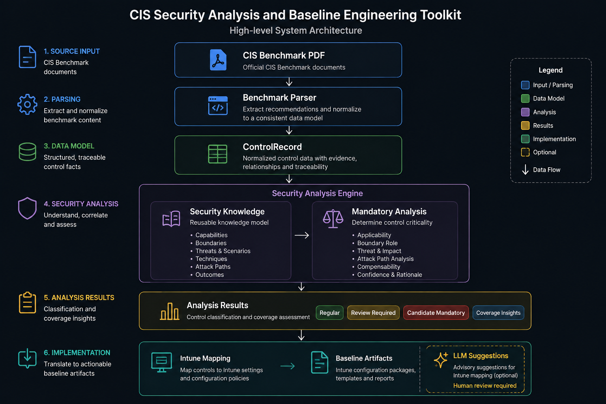

# CIS Security Analysis and Baseline Engineering Toolkit


A deterministic toolkit for parsing CIS Benchmarks, evaluating Mandatory control candidates, enriching controls with reusable Security Knowledge, comparing benchmark versions, and optionally mapping supported controls to Microsoft Intune.

> **CIS benchmark content is not included.** Obtain benchmark documents separately and comply with the CIS Terms of Use. 

## What it does

- Parses supported CIS Benchmark PDFs into traceable `ControlRecord` JSONL or CSV.
- Classifies controls as **Regular Control**, **Review Required**, or **Candidate Mandatory**.
- Evaluates security boundaries, attack paths, capabilities, threats, techniques, and outcomes.
- Compares structured exports between benchmark versions.
- Maps supported Windows Server controls to Intune using deterministic rule packs.
- Uses optional LLM suggestions only for unresolved Intune mappings; suggestions remain advisory.

## Architecture




The parser establishes source evidence. Mandatory reasoning and Security Knowledge operate on structured records. Intune mapping is a downstream implementation capability and is not part of the authoritative knowledge model.

## Quick Start

### Install

```bash
git clone https://github.com/koensmink/cis-intune-baseline-generator.git
cd cis-intune-baseline-generator
python -m pip install -e .
```

Python **3.10 or later** is required.

### Three-step analysis workflow

1. Parse the benchmark:

```bash
cis-pdf2csv benchmark.pdf -p L1 -o controls.jsonl --format jsonl
```

2. Analyze base Mandatory classifications:

```bash
cis-mandatory-analyze controls.jsonl -o mandatory-review.csv
```

3. Apply an already-validated structured ThreatContext:

```bash
cis-threat-analyze \
  controls.jsonl \
  --threat-context threat-context.json \
  --at-time 2026-08-24T12:00:00Z \
  -o threat-overlay.csv
```

The Mandatory classification and threat relevance are independent dimensions:

- Base classification: **Candidate Mandatory**, **Review Required**, or **Regular Control**.
- Threat relevance: **Normal**, **Elevated**, **High**, or **Critical**.

For example, a control can remain `Regular Control` while receiving `High` threat relevance and the advisory action `prioritize`. It has not become Mandatory. The threat CLI recomputes the unchanged base assessment from the supplied controls, accepts repeated `--threat-context` flags, and performs no AI interpretation or remote ingestion.

### Optional advisory interpretation workflow

The OpenAI provider adapter is an optional, separate step for locally saved advisory
text. Obtain the text out of band; URLs and live feeds are not accepted.

```bash
export OPENAI_API_KEY="<runtime-secret>"
cis-threat-interpret advisory.txt \
  --source-type vendor_advisory \
  --source-name "Example Vendor" \
  --source-reference "ADV-2026-001" \
  --model "<structured-output-capable-model>" \
  --generated-at 2026-08-24T12:00:00Z \
  -o proposed-threat.json
```

Inspect the resulting untrusted `ProposedThreatInterpretation`, complete the
separate human approval/conversion step:

```bash
cis-threat-approve proposed-threat.json \
  --reviewer "security-engineer" \
  --approval approved \
  --reviewed-at 2026-08-24T12:30:00Z \
  --accept A-SOURCE \
  --accept A-PATH \
  --reject A-UNCERTAIN \
  --rationale "Reviewed against the locally supplied advisory" \
  -o threat-context.json
```

Every material assertion must be explicitly accepted or rejected; there is no
implicit approval or `--accept-all`. Use `--list-assertions` to inspect concise
assertions without creating an approval. Rejection and `needs_revision` are valid
outcomes and write approval records without creating a `ThreatContext`.

Only the approved `ThreatContext` may be supplied to `cis-threat-analyze`. The API
key is read at runtime by interpretation only and is never needed by approval.
Provider output cannot assign Mandatory status, select CIS controls, or assign
threat relevance. Provider, validation, and approval failures fail closed.

### Optional: map supported controls to Intune

```bash
cis-intune-map controls.jsonl -o intune_out
```

See [CLI Usage](docs/CLI_USAGE.md) for all commands, options, container examples, benchmark diff usage, and LLM fallback.

## Core Components

### CIS Benchmark Parser

Converts supported CIS Benchmark PDF layouts into structured, evidence-bearing records. Source traceability includes page ranges, PDF and extracted-block hashes, parser version, and extraction timestamp.

Supported benchmark identity does not automatically mean every historical PDF layout is compatible.

See [CIS Benchmark Parser](docs/CIS_BENCHMARK_PARSER.md).

### Mandatory Control Engine

The deterministic Mandatory engine evaluates parser-produced controls and emits:

- **Candidate Mandatory** — formal criteria and security-boundary evidence are sufficient for human review.
- **Review Required** — applicability, evidence, overlap, completeness, or knowledge resolution is uncertain.
- **Regular Control** — Candidate criteria are not met and adjudication is not required.

The engine never grants Definitive Mandatory status automatically.

Validated Windows Server L1 regression reference:

- **307 controls**
- **27 Candidate Mandatory**
- **5 Review Required**
- **275 Regular Control**

See [Mandatory Control Engine — Phase 1](docs/mandatory-control-phase1.md).

### Security Knowledge

The Security Knowledge model provides reusable, source-independent definitions for security capabilities, boundaries, threat scenarios, attack techniques, attack paths, outcomes, and mitigation relationships.

Mandatory status is derived from resolved knowledge and assessment context; it is not a catalog property.

See:

- [Security Knowledge Model](docs/SECURITY_KNOWLEDGE_MODEL.md)
- [Security Knowledge Catalog](docs/SECURITY_KNOWLEDGE_CATALOG.md)
- [Security Knowledge Model Implementation](docs/SECURITY_KNOWLEDGE_MODEL_IMPLEMENTATION.md)

### Intune Mapping

The Intune mapper is a downstream implementation engine. Current deterministic rule packs target supported Windows Server controls and produce baseline, manual-review, conflict, policy, and optional suggestion artifacts.

Unsupported benchmark families do not run Windows-specific rules.

### Benchmark Diff

The diff module compares parser-produced JSONL exports and reports added, removed, and field-level changed controls.

See [CLI Usage](docs/CLI_USAGE.md#benchmark-diff).

## Workflow

1. Obtain a CIS Benchmark PDF.
2. Parse it into structured `ControlRecord` data.
3. Run deterministic Mandatory analysis.
4. Resolve and validate Security Knowledge relationships.
5. Review Candidate Mandatory and Review Required results.
6. Evaluate attack-path and boundary coverage.
7. Optionally map supported controls to Intune.
8. Compare benchmark versions when required.

## Supported Scope

| Area | Current scope |
|---|---|
| Parser identities | Microsoft Windows Server and Microsoft 365 Foundations identity headers |
| Mandatory reference | Windows Server L1 regression fixture and implemented boundary knowledge |
| M365 analysis | Selected domains in advisory normative shadow mode |
| Intune mapping | Deterministic Windows Server rule packs |
| Future families | Architecture is source-independent, but unsupported families are not implicitly supported |

For parser-specific compatibility and failure behavior, see [CIS Benchmark Parser](docs/CIS_BENCHMARK_PARSER.md).

## Documentation

| Document | Purpose |
|---|---|
| [CLI Usage](docs/CLI_USAGE.md) | Commands, options, examples, containers, diff, and LLM fallback |
| [CIS Benchmark Parser](docs/CIS_BENCHMARK_PARSER.md) | Parser behavior, inputs, outputs, traceability, profiles, and limitations |
| [Mandatory Control Engine — Phase 1](docs/mandatory-control-phase1.md) | Mandatory classification and boundary reasoning |
| [Security Knowledge Model](docs/SECURITY_KNOWLEDGE_MODEL.md) | Normative knowledge model |
| [Security Knowledge Catalog](docs/SECURITY_KNOWLEDGE_CATALOG.md) | Authoritative reusable catalog |
| [Security Knowledge Model Implementation](docs/SECURITY_KNOWLEDGE_MODEL_IMPLEMENTATION.md) | Implementation details |
| [Threat-Informed Prioritization](docs/THREAT_INFORMED_PRIORITIZATION.md) | Structured threat resolution, advisory prioritization, and CLI exports |
| [v1 Release Notes](docs/V1_RELEASE_NOTES.md) | Release-specific notes |

## License and CIS Content

Source code is licensed under the [MIT License](LICENSE).

CIS benchmark content is not distributed with this repository and remains subject to CIS terms.

## Disclaimer 

CIS Benchmarks™ is a trademark of the Center for Internet Security, Inc. (CIS). This project is an independent open-source project and is not affiliated with, sponsored by, or endorsed by CIS. CIS Benchmark content is not distributed with this software.
